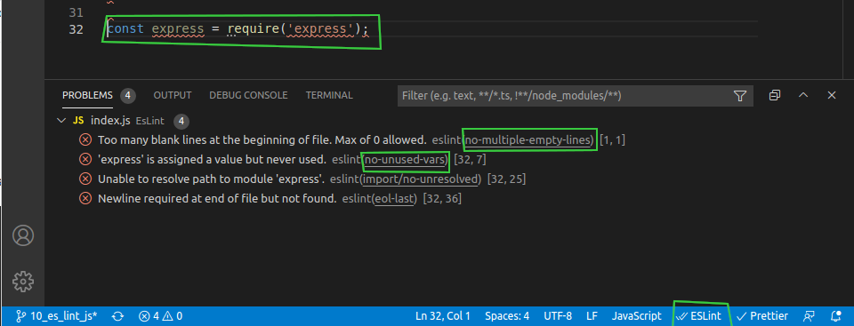

# Javascript-basic-referance

### ES-Lint

- [Tutorial](https://www.youtube.com/watch?v=SydnKbGc7W8&t=145s) [Docs](https://eslint.org/) [Rules](https://eslint.org/docs/rules/) [Play ground](https://eslint.org/demo)
- Install ESLint for VSC
- Install Prettier -> Go to Preferances -> search for **formant on save** check it-> Restart VSC and once again search for **Prettier** -> and check on **Prettier:SingleQuote**
- Initilize node project using `npm init` -> Install some packages - check in dev dependecies in package.json

```
npm i -D eslint prettier eslint-plugin-prettier eslint-config-prettier eslint-plugin-node eslint-config-node
```

- contains all ESLint rules usint **eslint-config-airbnb**, [know more](https://www.npmjs.com/package/eslint-config-airbnb)

```
npx install-peerdeps --dev eslint-config-airbnb
```

- Create a prettier file with name of **.prettierrc** [All the options for setup prettier](https://prettier.io/docs/en/options.html#docsNav)
- For [configuring es lint](https://eslint.org/docs/user-guide/configuring/) we can create a file **.eslintrc.json** or we can [install globally](https://eslint.org/docs/user-guide/command-line-interface) `sudo npm install -g eslint`
- [Initilize eslint](https://eslint.org/docs/user-guide/command-line-interface#miscellaneous) file using `estlint --init`
- Write code and open problems tab in VSC -> find all the specific problems -> search with that problem name in [here](https://eslint.org/docs/rules/)


